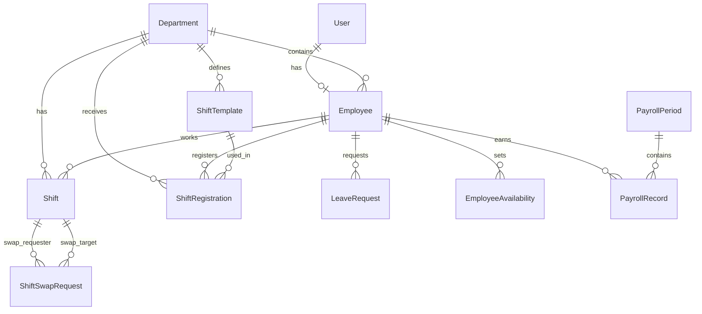

# ESMS — Employee Scheduling Management System

> Hệ thống quản lý lịch làm việc nhân viên toàn diện, xây dựng trên **Next.js 16**, **React 19**, **Prisma 7**, **PostgreSQL (Supabase)** và **Upstash Redis**.

---

## 📋 Mục lục

- [Tổng quan](#tổng-quan)
- [Tech Stack](#tech-stack)
- [Kiến trúc hệ thống](#kiến-trúc-hệ-thống)
- [Tính năng chính](#tính-năng-chính)
- [Phân quyền (RBAC)](#phân-quyền-rbac)
- [Database Schema](#database-schema)
- [Cấu trúc thư mục](#cấu-trúc-thư-mục)
- [API Endpoints](#api-endpoints)
- [Cài đặt & Chạy](#cài-đặt--chạy)
- [Biến môi trường](#biến-môi-trường)
- [Performance Optimizations](#performance-optimizations)

---

## Tổng quan

**ESMS** là hệ thống quản lý lịch làm việc cho doanh nghiệp, hỗ trợ:

- Quản lý **nhân viên** và **phòng ban**
- Tạo & phân công **ca làm việc** (shifts)
- Nhân viên **đăng ký ca** → Manager duyệt
- **Đổi ca** giữa nhân viên (swap requests)
- Quản lý **nghỉ phép** (leave requests)
- Tính **lương** tự động (payroll) với hỗ trợ OT
- **Dashboard** thống kê theo role

---

## Tech Stack

| Layer | Công nghệ | Phiên bản |
|-------|-----------|-----------|
| **Framework** | Next.js (App Router) | 16.1.6 |
| **UI** | React | 19.2.3 |
| **Styling** | Tailwind CSS | 4.x |
| **Icons** | Lucide React | 0.577.0 |
| **Database** | PostgreSQL (Supabase) | — |
| **ORM** | Prisma | 7.4.2 |
| **Cache** | Upstash Redis | 1.36.3 |
| **Auth** | NextAuth.js (JWT) | 4.24.13 |
| **Password** | bcryptjs | 3.0.3 |
| **Date Utils** | date-fns | 4.1.0 |
| **Language** | TypeScript | 5.x |

---

## Kiến trúc hệ thống

```
┌──────────────────────────────────────────────────┐
│                   Client (React)                 │
│   Dashboard │ Schedule │ Registrations │ Payroll  │
│   Employees │ Departments │ Leaves │ Swaps       │
└────────────────────┬─────────────────────────────┘
                     │ fetch()
                     ▼
┌──────────────────────────────────────────────────┐
│              Next.js API Routes                  │
│  /api/employees │ /api/shifts │ /api/payroll ... │
│                                                  │
│  ┌─────────────┐    ┌──────────────────────────┐ │
│  │  NextAuth    │    │   Redis Cache (Upstash)  │ │
│  │  JWT Auth    │    │   cached() / invalidate  │ │
│  └─────────────┘    └──────────────────────────┘ │
└────────────────────┬─────────────────────────────┘
                     │ Prisma ORM
                     ▼
┌──────────────────────────────────────────────────┐
│          PostgreSQL (Supabase - Sydney)           │
│   User │ Employee │ Shift │ PayrollPeriod │ ...  │
└──────────────────────────────────────────────────┘
```

---

## Tính năng chính

### 🏢 Quản lý phòng ban (Departments)
- CRUD phòng ban
- Mỗi phòng ban có **Shift Templates** (mẫu ca: Morning, Afternoon, Night…)
- Hiển thị số nhân viên trong phòng ban

### 👥 Quản lý nhân viên (Employees)
- Tạo nhân viên kèm tài khoản đăng nhập tự động
- Gán phòng ban, thiết lập **hourly rate** và **overtime multiplier**
- Giới hạn giờ làm tối đa/tuần (`maxHoursPerWeek`)

### 📅 Lịch làm việc (Schedule)
- Xem lịch theo tuần với navigation
- Hiển thị ca theo phòng ban
- Tạo ca mới (Admin/Manager)
- **Conflict Engine**: phát hiện trùng ca khi tạo mới
- Cache-aside pattern với Redis

### 📝 Đăng ký ca (Shift Registrations)
- Nhân viên đăng ký ca dựa trên Shift Templates
- Manager/Admin duyệt (Approve) hoặc từ chối (Reject)
- **Approve All** — duyệt hàng loạt
- Tự động tạo Shift khi approve
- Chặn đăng ký ngày đã qua

### 🔄 Đổi ca (Shift Swaps)
- Nhân viên nhập username đồng nghiệp để yêu cầu đổi ca
- Luồng 3 bước:
  1. **Hệ thống kiểm tra** ca hợp lệ
  2. **Nhân viên B** chấp nhận/từ chối
  3. **Manager** duyệt cuối cùng
- Tự động hoán đổi `employeeId` trên shifts khi approve

### 🏖️ Nghỉ phép (Leave Requests)
- Nhân viên tạo yêu cầu nghỉ phép (ngày bắt đầu → kết thúc + lý do)
- Manager/Admin duyệt hoặc từ chối
- Chặn tạo nghỉ phép cho ngày đã qua

### 💰 Tính lương (Payroll)
- Chọn khoảng thời gian → hệ thống tự tính lương cho tất cả nhân viên
- Tính dựa trên ca thực tế (shifts `PUBLISHED`)
- Hỗ trợ **OT Rules** linh hoạt:
  - **Weekly Threshold**: vượt X giờ/tuần → OT
  - **Daily Threshold**: vượt X giờ/ngày → OT  
  - **Late Night**: làm sau giờ Y → OT
- Công thức: `grossPay = regularHours × hourlyRate + overtimeHours × hourlyRate × overtimeMultiplier`
- Trừ khấu (deductions) thủ công
- Luồng: `DRAFT` → `CONFIRMED` → `PAID`

### 📊 Dashboard
- **Admin**: tổng nhân viên, phòng ban, ca tuần này, leave pending, biểu đồ tuần, activity log
- **Manager**: thống kê phòng ban, biểu đồ ca, activity log
- **Staff**: ca tuần này, ca sắp tới, leave pending, biểu đồ cá nhân

### 👤 Profile
- Xem thông tin cá nhân
- Đổi mật khẩu

---

## Phân quyền (RBAC)

Hệ thống sử dụng **Role-Based Access Control** với 3 roles:

| Tính năng | ADMIN | MANAGER | STAFF |
|-----------|:-----:|:-------:|:-----:|
| Dashboard (system-wide) | ✅ | — | — |
| Dashboard (department) | — | ✅ | — |
| Dashboard (personal) | — | — | ✅ |
| Quản lý phòng ban | ✅ | — | — |
| Tạo nhân viên | ✅ | ✅ | — |
| Xem nhân viên (all) | ✅ | — | — |
| Xem nhân viên (department) | — | ✅ | — |
| Tạo/xóa ca | ✅ | ✅ | — |
| Đăng ký ca | — | — | ✅ |
| Duyệt đăng ký ca | ✅ | ✅ | — |
| Duyệt đổi ca | ✅ | ✅ | — |
| Duyệt nghỉ phép | ✅ | ✅ | — |
| Tạo payroll | ✅ | ✅ | — |
| Xem payroll cá nhân | — | — | ✅ |

---

## Database Schema



### Models chính

| Model | Mô tả |
|-------|-------|
| `User` | Tài khoản (email, password hash, role) |
| `Employee` | Hồ sơ nhân viên (tên, phòng ban, lương/giờ, hệ số OT) |
| `Department` | Phòng ban |
| `ShiftTemplate` | Mẫu ca (tên, giờ bắt đầu/kết thúc) |
| `Shift` | Ca làm thực tế (ngày, giờ, status DRAFT/PUBLISHED) |
| `ShiftRegistration` | Đăng ký ca (PENDING → APPROVED/REJECTED) |
| `ShiftSwapRequest` | Yêu cầu đổi ca (PENDING_TARGET → PENDING_MANAGER → APPROVED) |
| `LeaveRequest` | Yêu cầu nghỉ phép (PENDING → APPROVED/REJECTED) |
| `PayrollPeriod` | Kỳ lương (DRAFT → CONFIRMED → PAID) |
| `PayrollRecord` | Bảng lương chi tiết từng nhân viên |
| `EmployeeAvailability` | Lịch rảnh nhân viên |

---

## Cấu trúc thư mục

```
ESMS/
├── prisma/
│   ├── schema.prisma          # Database schema
│   └── migrations/            # DB migrations
├── src/
│   ├── app/
│   │   ├── api/               # API Routes (Next.js Route Handlers)
│   │   │   ├── auth/          #   NextAuth endpoint
│   │   │   ├── departments/   #   CRUD departments
│   │   │   ├── employees/     #   CRUD employees
│   │   │   ├── leaves/        #   Leave request management
│   │   │   ├── payroll/       #   Payroll generation & management
│   │   │   ├── profile/       #   User profile & password change
│   │   │   ├── registrations/ #   Shift registration (+ bulk approve)
│   │   │   ├── shifts/        #   Schedule shifts (+ bulk operations)
│   │   │   ├── stats/         #   Dashboard statistics
│   │   │   └── swaps/         #   Shift swap requests
│   │   ├── departments/       # Departments page
│   │   ├── employees/         # Employees page
│   │   ├── leaves/            # Leave requests page
│   │   ├── login/             # Login page
│   │   ├── payroll/           # Payroll page
│   │   ├── profile/           # Profile page
│   │   ├── registrations/     # Shift registrations page
│   │   ├── schedule/          # Schedule (calendar) page
│   │   ├── swaps/             # Swap requests page
│   │   ├── page.tsx           # Dashboard (home page)
│   │   ├── layout.tsx         # Root layout
│   │   ├── providers.tsx      # Session provider
│   │   └── globals.css        # Global styles
│   ├── components/
│   │   ├── layout/
│   │   │   └── Sidebar.tsx    # Navigation sidebar
│   │   └── schedule/
│   │       └── AddShiftModal.tsx  # Add shift dialog
│   └── lib/
│       ├── auth.ts            # NextAuth config (JWT, credentials)
│       ├── prisma.ts          # Prisma client singleton
│       └── redis.ts           # Upstash Redis + cache helpers
├── .env                       # Environment variables
├── package.json
└── tsconfig.json
```

---

## API Endpoints

### Authentication
| Method | Endpoint | Mô tả |
|--------|----------|-------|
| POST | `/api/auth/[...nextauth]` | NextAuth login/session |

### Employees
| Method | Endpoint | Mô tả |
|--------|----------|-------|
| GET | `/api/employees` | Danh sách nhân viên (role-filtered) |
| POST | `/api/employees` | Tạo nhân viên mới + tài khoản |
| GET | `/api/employees/[id]` | Chi tiết nhân viên |
| PATCH | `/api/employees/[id]` | Cập nhật nhân viên |
| DELETE | `/api/employees/[id]` | Xóa nhân viên |

### Departments
| Method | Endpoint | Mô tả |
|--------|----------|-------|
| GET | `/api/departments` | Danh sách phòng ban |
| POST | `/api/departments` | Tạo phòng ban + templates |
| PATCH | `/api/departments/[id]` | Cập nhật phòng ban |
| DELETE | `/api/departments/[id]` | Xóa phòng ban |

### Shifts
| Method | Endpoint | Mô tả |
|--------|----------|-------|
| GET | `/api/shifts` | Lịch ca (theo tuần, department) |
| POST | `/api/shifts` | Tạo ca mới (conflict check) |
| PATCH | `/api/shifts/[id]` | Cập nhật ca |
| DELETE | `/api/shifts/[id]` | Xóa ca |
| POST | `/api/shifts/bulk` | Thao tác hàng loạt (publish/delete) |

### Registrations
| Method | Endpoint | Mô tả |
|--------|----------|-------|
| GET | `/api/registrations` | Danh sách đăng ký ca |
| POST | `/api/registrations` | Đăng ký ca mới |
| PATCH | `/api/registrations/[id]` | Duyệt/từ chối đăng ký |
| DELETE | `/api/registrations/[id]` | Hủy đăng ký |
| PATCH | `/api/registrations/bulk` | Duyệt tất cả |

### Leave Requests
| Method | Endpoint | Mô tả |
|--------|----------|-------|
| GET | `/api/leaves` | Danh sách yêu cầu nghỉ phép |
| POST | `/api/leaves` | Tạo yêu cầu nghỉ phép |
| PATCH | `/api/leaves/[id]` | Duyệt/từ chối |
| DELETE | `/api/leaves/[id]` | Hủy yêu cầu |

### Shift Swaps
| Method | Endpoint | Mô tả |
|--------|----------|-------|
| GET | `/api/swaps` | Danh sách yêu cầu đổi ca |
| POST | `/api/swaps` | Tạo yêu cầu đổi ca |
| PATCH | `/api/swaps/[id]` | Accept/reject/approve |

### Payroll
| Method | Endpoint | Mô tả |
|--------|----------|-------|
| GET | `/api/payroll` | Danh sách kỳ lương |
| POST | `/api/payroll` | Tạo kỳ lương mới (auto-calculate) |
| PATCH | `/api/payroll/[id]` | Cập nhật status/deductions |
| DELETE | `/api/payroll/[id]` | Xóa kỳ lương |

### Others
| Method | Endpoint | Mô tả |
|--------|----------|-------|
| GET | `/api/stats` | Dashboard statistics (role-scoped) |
| GET | `/api/profile` | Thông tin profile |
| PATCH | `/api/profile` | Đổi mật khẩu |

---

## Cài đặt & Chạy

### Yêu cầu
- **Node.js** >= 18
- **PostgreSQL** database (hoặc Supabase)
- **Upstash Redis** account

### Cài đặt

```bash
# Clone repo
git clone <repo-url>
cd ESMS

# Cài dependencies
npm install

# Cấu hình environment variables
cp .env.example .env
# Sửa .env với thông tin database và Redis

# Chạy migration
npx prisma migrate dev

# Generate Prisma Client
npx prisma generate

# Chạy dev server
npm run dev
```

Truy cập: [http://localhost:3000](http://localhost:3000)

### Build Production

```bash
npm run build
npm start
```

---

## Biến môi trường

| Biến | Mô tả | Ví dụ |
|------|-------|-------|
| `NEXTAUTH_SECRET` | JWT secret key | `TH69uAJz1fio...` |
| `NEXTAUTH_URL` | App URL | `http://localhost:3000` |
| `DATABASE_URL` | PostgreSQL connection (pooling) | `postgresql://...?pgbouncer=true` |
| `DIRECT_URL` | Direct DB connection (migrations) | `postgresql://...` |
| `UPSTASH_REDIS_REST_URL` | Upstash Redis REST URL | `https://xxx.upstash.io` |
| `UPSTASH_REDIS_REST_TOKEN` | Upstash Redis token | `ARIMAAImcDE...` |

---

## Performance Optimizations

### 1. Redis Caching (Upstash)
- **Cache-aside pattern**: Lần đầu query DB → lưu Redis → lần sau đọc trực tiếp từ Redis
- TTL: 30-120s tùy endpoint
- Auto-invalidation khi mutation

### 2. Optimistic UI Updates
- Approve/reject/delete cập nhật UI **tức thì**, API gọi ngầm
- Rollback nếu API lỗi
- Áp dụng trên: Registrations, Leaves, Swaps, Payroll

### 3. Database Indexes
- `Shift(status, date)` — tăng tốc payroll queries
- `PayrollRecord(payrollPeriodId)` — tăng tốc load chi tiết kỳ lương

### 4. Leaner API Payloads
- Sử dụng Prisma `select` thay vì `include` toàn bộ
- Giảm kích thước response

---

## License

Private — All rights reserved.
